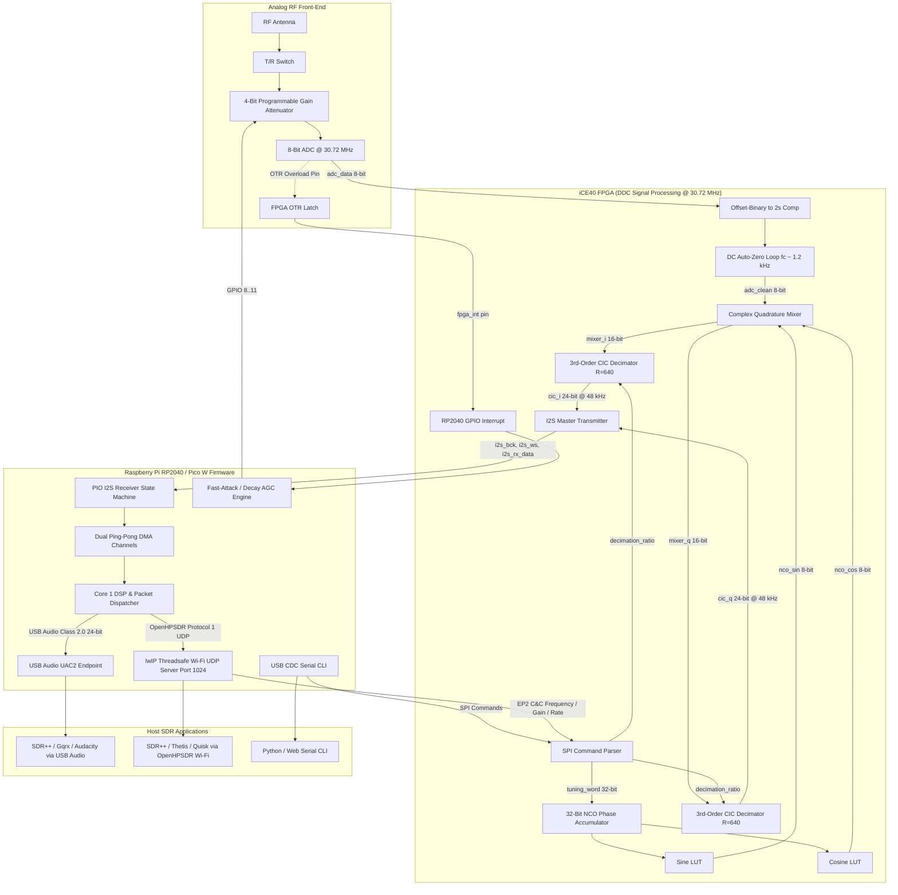
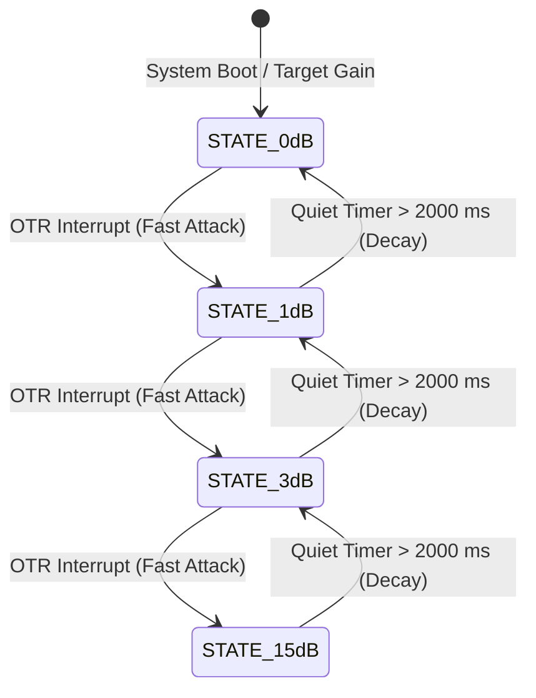

# Pico Dev-iCE Software & DSP Architecture

This document provides a comprehensive technical reference for the **Pico Dev-iCE Software-Defined Radio (SDR)** system, detailing the mathematical foundations of the Digital Down-Conversion (DDC) pipeline, the Programmable Gain Amplifier (PGA) control and Automatic Gain Control (AGC) algorithms, the system block diagrams, and the software repository directory layout.

---

## Table of Contents
1. [System Architecture & Block Diagram](#1-system-architecture--block-diagram)
2. [Mathematical Foundations of the DSP Pipeline](#2-mathematical-foundations-of-the-dsp-pipeline)
   - [2.1 RF Sampling & Offset-Binary Conversion](#21-rf-sampling--offset-binary-conversion)
   - [2.2 DC Auto-Zero Offset Correction](#22-dc-auto-zero-offset-correction)
   - [2.3 Numerically Controlled Oscillator (NCO)](#23-numerically-controlled-oscillator-nco)
   - [2.4 Complex Quadrature Downconversion (Mixer)](#24-complex-quadrature-downconversion-mixer)
   - [2.5 Cascaded Integrator-Comb (CIC) Decimating Filter](#25-cascaded-integrator-comb-cic-decimating-filter)
   - [2.6 Output Scaling & Bit Growth Analysis](#26-output-scaling--bit-growth-analysis)
   - [2.7 I2S Baseband Transmission](#27-i2s-baseband-transmission)
3. [PGA Gain Control & AGC Algorithm](#3-pga-gain-control--agc-algorithm)
   - [3.1 Hardware PGA Architecture](#31-hardware-pga-architecture)
   - [3.2 Manual Gain Control & OpenHPSDR Protocol 1 Mapping](#32-manual-gain-control--openhpsdr-protocol-1-mapping)
   - [3.3 Fast-Attack / Timed-Decay Overload AGC](#33-fast-attack--timed-decay-overload-agc)
4. [Software Directory Overview](#4-software-directory-overview)
   - [4.1 ddc_sdr_firmware](#41-ddc_sdr_firmware)
   - [4.2 ddc_sdr_firmware_usb_working](#42-ddc_sdr_firmware_usb_working)
   - [4.3 Soapy-Dev-iCE](#43-soapy-dev-ice)
   - [4.4 Pico Dev-iCE MicroPython](#44-pico-dev-ice-micropython)
   - [4.5 pico-ice-sdk](#45-pico-ice-sdk)

---

## 1. System Architecture & Block Diagram

The Pico Dev-iCE SDR partitions signal processing between a high-speed **Lattice iCE40UP5K FPGA** (performing real-time Digital Down-Conversion, filtering, and decimation at 30.72 MHz) and a **Raspberry Pi RP2040 / Pico W MCU** (handling DMA sample acquisition, USB Audio streaming, Wi-Fi OpenHPSDR Protocol 1 streaming, AGC supervision, and Command & Control).



---

## 2. Mathematical Foundations of the DSP Pipeline

### 2.1 RF Sampling & Offset-Binary Conversion
The analog RF input is digitized by an 8-bit Flash ADC clocked at $f_s = 30.720\text{ MHz}$. The ADC produces unsigned offset-binary samples $x_{raw}[n] \in [0, 255]$.

To convert unsigned offset-binary to 8-bit signed two’s complement $x_{signed}[n] \in [-128, 127]$, the MSB is inverted:

$$x_{signed}[n] = x_{raw}[n] - 128 = \left( \sim x_{raw}[7] \right) \mathbin{\Vert} x_{raw}[6:0]$$

---

### 2.2 DC Auto-Zero Offset Correction
ADC hardware imperfection and local board coupling introduce a static DC offset bias $V_{DC}$. If passed uncorrected into the mixer, $V_{DC} \cdot \cos(\omega_{lo} n)$ produces a massive spurious tone directly at the tuned center frequency ($0\text{ Hz}$ IF).

An autonomous digital tracking loop dynamically integrates and subtracts this DC bias before mixing:

$$\text{dc\_acc}[n] = \text{dc\_acc}[n-1] + x_{signed}[n] - \text{sign\_ext}\left(\text{dc\_acc}[n-1][23:12]\right)$$

$$x_{clean}[n] = \text{saturate}_{[-128, 127]}\left( x_{signed}[n] - \text{dc\_acc}[n][23:12] \right)$$

This creates a high-pass notch with a cutoff frequency:

$$f_{c} \approx \frac{f_s}{2^{12} \cdot 2\pi} = \frac{30.720\text{ MHz}}{4096 \cdot 2\pi} \approx 1.193\text{ kHz}$$

This eliminates center-frequency LO carrier spikes without degrading passband signals.

---

### 2.3 Numerically Controlled Oscillator (NCO)
The NCO implements a 32-bit phase accumulator clocked at $f_{clk} = 30.720\text{ MHz}$. For a target RF center frequency $f_{tune}$, the RP2040 calculates the 32-bit integer tuning word $M$:

$$M = \operatorname{round}\left( \frac{f_{tune}}{f_{clk}} \cdot 2^{32} \right) = \operatorname{round}\left( \frac{f_{tune}}{30{,}720{,}000} \cdot 4{,}294{,}967{,}296 \right)$$

The phase accumulator updates on every clock cycle:

$$\theta[n] = \left( \theta[n-1] + M \right) \pmod{2^{32}}$$

The frequency resolution $\Delta f$ is:

$$\Delta f = \frac{f_{clk}}{2^{32}} = \frac{30.720\text{ MHz}}{4{,}294{,}967{,}296} \approx 0.007153\text{ Hz}$$

The top 8 bits $\theta[n][31:24]$ index 256-word quarter-wave trigonometric lookup tables to yield 8-bit signed quadrature LO reference signals:

$$I_{lo}[n] = \cos\left( \frac{2\pi \cdot \theta[n]}{2^{32}} \right), \quad Q_{lo}[n] = \sin\left( \frac{2\pi \cdot \theta[n]}{2^{32}} \right)$$

---

### 2.4 Complex Quadrature Downconversion (Mixer)
The clean real RF input signal $x_{clean}[n]$ is multiplied by the quadrature LO signals $I_{lo}[n]$ and $Q_{lo}[n]$ to produce in-phase ($I$) and quadrature ($Q$) products:

$$I_{mix}[n] = x_{clean}[n] \cdot I_{lo}[n] = x_{clean}[n] \cos(\omega_{lo} n)$$

$$Q_{mix}[n] = x_{clean}[n] \cdot Q_{lo}[n] = x_{clean}[n] \sin(\omega_{lo} n)$$

For an arbitrary narrowband input signal $x(t) = A(t) \cos(\omega_{rf} t + \phi(t))$ where $\omega_{rf} = \omega_{lo} + \omega_{if}$:

$$I_{mix}(t) = \frac{A(t)}{2}\left[ \cos(\omega_{if} t + \phi(t)) + \cos((2\omega_{lo} + \omega_{if})t + \phi(t)) \right]$$

$$Q_{mix}(t) = \frac{A(t)}{2}\left[ -\sin(\omega_{if} t + \phi(t)) + \sin((2\omega_{lo} + \omega_{if})t + \phi(t)) \right]$$

The complex analytic signal at the mixer output is:

$$z_{mix}(t) = I_{mix}(t) + j Q_{mix}(t) = \frac{A(t)}{2} e^{-j(\omega_{if} t + \phi(t))} + \frac{A(t)}{2} e^{j((2\omega_{lo} + \omega_{if})t + \phi(t))}$$

The high-frequency $2\omega_{lo}$ sum term is removed by the subsequent decimation filter, isolating the baseband spectrum $e^{-j\omega_{if} t}$.

---

### 2.5 Cascaded Integrator-Comb (CIC) Decimating Filter
Decimation and low-pass anti-aliasing filtering are implemented using a **3-Stage Cascaded Integrator-Comb (CIC) filter** (Hogenauer, 1981) with differential delay $M=1$ and decimation ratio $R = 640$ (for $48\text{ kHz}$) or $R = 320$ (for $96\text{ kHz}$).

The system transfer function in the $z$-domain is:

$$H(z) = \left( \frac{1 - z^{-R M}}{1 - z^{-1}} \right)^N = \left( \sum_{k=0}^{R M - 1} z^{-k} \right)^N, \quad N=3, \; M=1$$

The discrete-time frequency response is:

$$|H(f)| = \left| \frac{\sin\left(\pi \frac{R M f}{f_s}\right)}{\sin\left(\pi \frac{f}{f_s}\right)} \right|^N$$

#### Filter Structure:
1. **3 Integrator Stages** clocked at full ADC rate $f_s = 30.72\text{ MHz}$:
   $$I_1[n] = I_1[n-1] + x[n]$$
   $$I_2[n] = I_2[n-1] + I_1[n]$$
   $$I_3[n] = I_3[n-1] + I_2[n]$$
2. **Decimator $\downarrow R$**: Samples $I_3[n]$ every $R=640$ clocks ($f_{out} = 48\text{ kHz}$).
3. **3 Comb Stages** clocked at decimated rate $f_{out}$:
   $$C_1[m] = I_3[m] - I_3[m-1]$$
   $$C_2[m] = C_1[m] - C_1[m-1]$$
   $$C_3[m] = C_2[m] - C_2[m-1]$$

---

### 2.6 Output Scaling & Bit Growth Analysis

#### DC Gain:
$$G = (R \cdot M)^N = 640^3 = 262{,}144{,}000 \approx 2^{27.966}$$

#### Maximum Bit Growth ($B_{growth}$):
$$B_{growth} = \lceil N \log_2(R \cdot M) \rceil = \lceil 3 \log_2(640) \rceil = \lceil 27.966 \rceil = 28\text{ bits}$$

#### Register Sizing:
With a 16-bit signed mixer input ($B_{in} = 16$), the internal accumulator width required to prevent mathematical overflow (by two’s complement wrap-around invariance) is:

$$B_{internal} = B_{in} + B_{growth} = 16 + 28 = 44\text{ bits}$$

#### Dynamic Range Slicing:
- Theoretical peak signed input: $|x_{in}| = 127 \times 128 = 16{,}256 \approx 2^{13.989}$
- Peak theoretical output: $16{,}256 \times 640^3 = 4.262 \times 10^{12} \approx 2^{41.95}$
- Bits $[43:42]$ are redundant sign-extension bits.
- By extracting bits **$[41:18]$** (24 bits total), the filter yields maximum 24-bit dynamic range with **$+12\text{ dB}$ higher sensitivity** while mathematically guaranteeing zero clipping on full-scale sinusoidal RF inputs.

---

### 2.7 I2S Baseband Transmission
The decimated 24-bit $I$ and $Q$ samples are transmitted over an I2S serial link:
- **Bit Clock (`i2s_bck`)**: $3.072\text{ MHz}$ ($64 \times 48\text{ kHz}$)
- **Word Select (`i2s_ws`)**: $48\text{ kHz}$ square wave
  - $\text{WS} = 0$ (Low): Left Channel = $I$ (In-phase sample)
  - $\text{WS} = 1$ (High): Right Channel = $Q$ (Quadrature sample)
- **Data (`i2s_rx_data`)**: 24-bit signed MSB-first, left-aligned in a 32-bit frame.

The RP2040 PIO state machine shifts 32 bits into the RX FIFO on each half-period of WS, populating memory buffers with alternating $(I, Q)$ pairs.

---

## 3. PGA Gain Control & AGC Algorithm

### 3.1 Hardware PGA Architecture
The analog front-end includes a 4-bit digitally controlled Programmable Gain Attenuator/Amplifier driven by RP2040 GPIOs $8, 9, 10, 11$ (`DDC_PGA_GPIO_BASE = 8`):

$$\text{PGA Code} \in [0x0, 0xF] \quad (0 \dots 15)$$

| PGA Code | Binary (`GPIO[11:8]`) | Nominal Attenuation | Front-End Net Gain | Mode / Typical Use |
|:---:|:---:|:---:|:---:|:---|
| **0x0** | `0000` | $0\text{ dB}$ | $+40\text{ dB}$ | Maximum Sensitivity / Weak Signal DX |
| **0x1** | `0001` | $-1\text{ dB}$ | $+39\text{ dB}$ | AGC Stage 1 Overload Cut |
| **0x2** | `0010` | $-2\text{ dB}$ | $+38\text{ dB}$ | Fine Manual Step |
| **0x3** | `0011` | $-3\text{ dB}$ | $+37\text{ dB}$ | AGC Stage 2 Overload Cut |
| $\dots$ | $\dots$ | $\dots$ | $\dots$ | Linear $1\text{ dB}$ steps |
| **0xF** | `1111` | $-15\text{ dB}$ | $+25\text{ dB}$ | AGC Maximum Overload Protection / Local Signals |

---

### 3.2 Manual Gain Control & OpenHPSDR Protocol 1 Mapping

Manual gain can be adjusted via CDC CLI or SDR software:
1. **CDC Serial CLI**:
   ```text
   PGA,<0..15>    # Sets attenuation code directly (0 = Max gain, 15 = Min gain)
   ```
2. **OpenHPSDR Protocol 1 / SDR++ Slider Mapping**:
   SDR++ presents an `LNA Gain` slider from $0\text{ dB}$ to $60\text{ dB}$ via Hermes-Lite Register `0x0A` (`HL_REG_RX_LNA`). The firmware maps this continuous slider to the discrete 4-bit hardware attenuation codes:

   $$\text{PGA Code} = 15 - \left\lfloor \frac{\text{Gain}_{SDR++} \times 15}{60} \right\rfloor$$

   - $\text{Gain}_{SDR++} = 60\text{ dB} \implies \text{PGA Code } 0$ (Max gain $+40\text{ dB}$)
   - $\text{Gain}_{SDR++} = 0\text{ dB} \implies \text{PGA Code } 15$ (Max attenuation / $+25\text{ dB}$)

---

### 3.3 Fast-Attack / Timed-Decay Overload AGC

When powerful out-of-band or in-band transmitters saturate the 8-bit ADC, the hardware ADC Out-Of-Range (`adc_otr`) pin fires. The FPGA catches this event, stretches the pulse, and asserts `fpga_int` to the RP2040.

#### AGC State Machine:


1. **Fast Attack (< 10 µs)**:
   When `fpga_int` triggers an interrupt:
   $$\text{Code}_{next} = \operatorname{StepUp}(\text{Code}_{current}): \quad 0\text{x0} \to 0\text{x1} \to 0\text{x3} \to 0\text{xF}$$
   The attenuator immediately steps to the next safe level, and an SPI command `DDC_FPGA_CMD_CLEAR_OTR` (0x04) clears the FPGA OTR latch.

2. **Hold & Timed Decay ($T_{decay} = 2000\text{ ms}$)**:
   - While `fpga_int` remains active or triggers repeatedly, the quiet timer resets to 0.
   - When the RF overload ceases, the system begins a $2000\text{ ms}$ quiet timer.
   - After $2000\text{ ms}$ with zero OTR pulses, the gain recovers by one step:
     $$\text{Code}_{prev} = \operatorname{StepDown}(\text{Code}_{current}): \quad 0\text{xF} \to 0\text{x3} \to 0\text{x1} \to 0\text{x0}$$
   - This prevents rapid gain pumping / flutter during intermittent high-signal transmissions.

---

## 4. Software Directory Overview

Below is the directory structure of the `Software/` folder and the purpose of each component:

```
Software/
├── README.md                    # DSP mathematics, PGA control, and architecture documentation (this file)
├── ddc_sdr_firmware/            # Primary active RP2040/Pico W production firmware
├── ddc_sdr_firmware_usb_working/ # Historical baseline USB-only firmware snapshot
├── Soapy-Dev-iCE/               # SoapySDR hardware driver module for SDR++/Gqrx
├── Pico Dev-iCE MicroPython/     # MicroPython runtime & hardware peripheral bindings
└── pico-ice-sdk/                # Low-level FPGA flashing & hardware abstraction library
```

---

### 4.1 `ddc_sdr_firmware`
**Active Production Firmware for RP2040 and Pico W.**
- **Dual-Path Streaming**:
  - **USB Audio Class 2.0 (UAC2)**: Isochronous 24-bit stereo audio streaming at 48/96 kHz.
  - **Wi-Fi OpenHPSDR Protocol 1**: Hermes SDR transceiver emulation over threadsafe background lwIP UDP on port 1024.
- **Hardware Bridges**:
  - **PIO I2S Driver (`i2s_rx.pio`)**: Non-blocking DMA-driven stereo receiver.
  - **FPGA CRAM DFU Loader**: Direct flashing and reprogramming of the iCE40 FPGA bitstream across boot and runtime.
  - **SPI Runtime Control**: High-speed frequency tuning, decimation rate switching, and OTR clearing.
- **Overload AGC Engine**: Multi-level fast-attack attenuator stepping with 2-second decay.
- **Full Duplex CDC Serial Interface**: CLI for frequency control, PGA setting, Wi-Fi configuration (`WIFI`, `SCAN`), and system status.

---

### 4.2 `ddc_sdr_firmware_usb_working`
**Reference USB Baseline Firmware.**
- Standalone snapshot of the firmware prior to Wi-Fi integration.
- Useful for minimal-footprint USB deployments or as a test golden reference.

---

### 4.3 `Soapy-Dev-iCE`
**SoapySDR Plugin for Native SDR Ecosystem Integration.**
- C++ hardware module implementing the `SoapySDR::Device` API.
- Enables native plug-and-play support for:
  - **SDR++** (via `soapy_source`)
  - **Gqrx**
  - **CubicSDR**
  - **GNU Radio** (via `gr-soapy` blocks)
- Exposes named gain elements (`PGA`, $0 \dots 15\text{ dB}$), hardware AGC switches, custom sample rates, and streaming channels.

---

### 4.4 `Pico Dev-iCE MicroPython`
**MicroPython Port for Interactive Experimentation.**
- MicroPython firmware build targeting the Pico Dev-iCE platform.
- Provides interactive Python REPL bindings to:
  - Load FPGA bitstreams from flash or filesystem.
  - Configure SPI/I2C registers dynamically.
  - Test custom DSP scripts and control GPIO pins interactively.

---

### 4.5 `pico-ice-sdk`
**Low-Level FPGA & Hardware Abstraction SDK.**
- Underlying C library providing:
  - iCE40 CRAM programming algorithms.
  - SPI flash pass-through programming.
  - Clock generation and RP2040-iCE40 pin mapping definitions.
